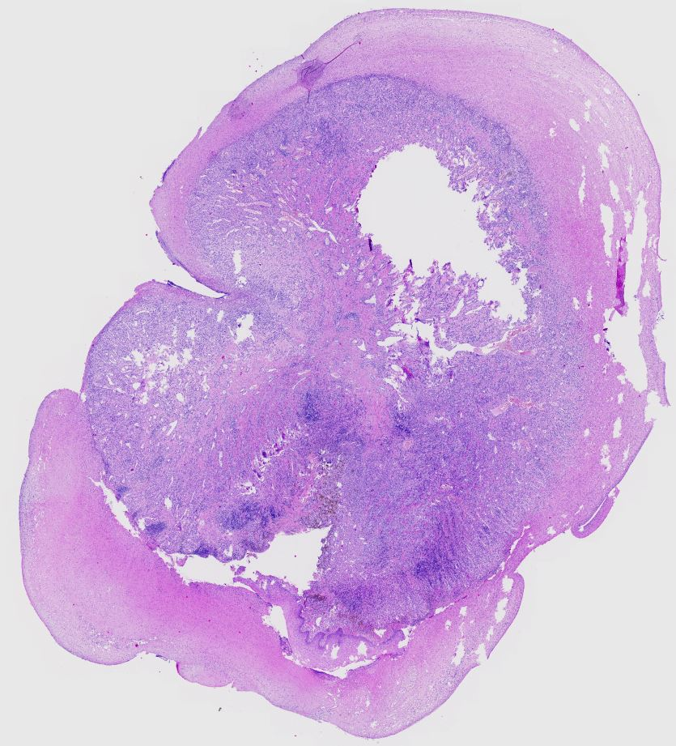

# Laryngeal Pyogenic Granuloma

Although these lesions are not typically yellow on gross examination, this case showed an unusual yellowish macroscopic appearance, which initially led clinicians to consider amyloid in the differential diagnosis.

View the slide at [https://metinciris.github.io/gallery-19/](https://metinciris.github.io/gallery-19/)

**Note:** Tiles are generated locally and included in the repository. Manually commit and push to GitHub to make the viewer work.
